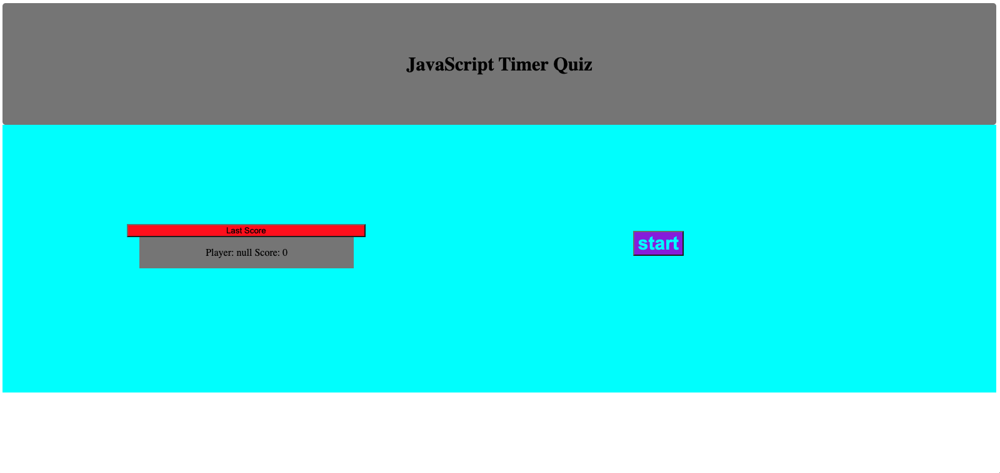
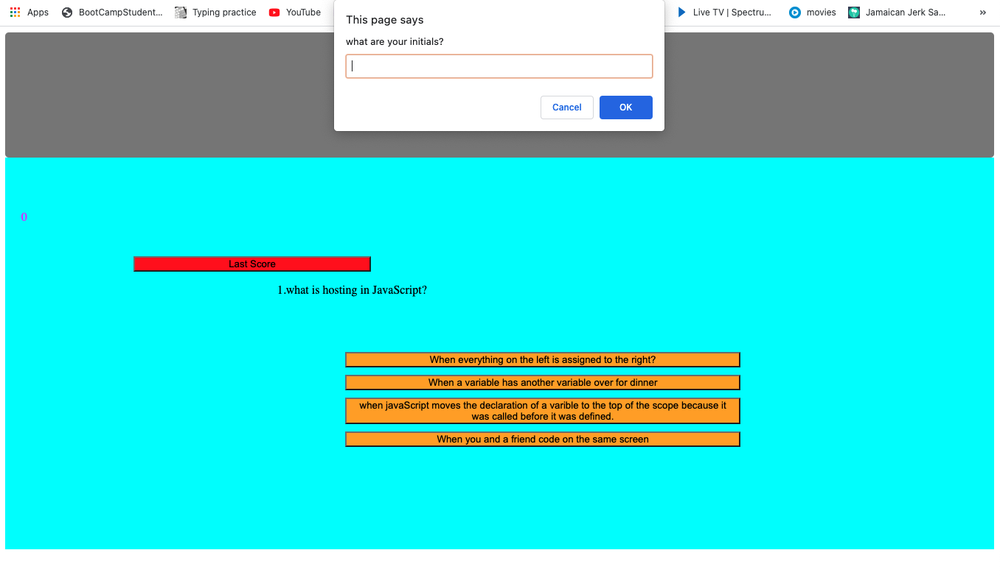

# This is a website that runs a simple JavaScript quiz. 

1. You are prompted with a last player and a start button 
2. When the start button is clicked the page wil change and display a question and some answers and a timer will start
3. When you click on a answer it will move to the next question right or wrong but if wrong time is taken from timer and iff right one is added to the score
4. Whem you get to the last question or yourtime has run out you are asked to store you initials and then the screen resets
5. When the screen resets the you are brought back to the start scren and shown the last player who took the quiz and the score 
6. At any poin after pressing the start button the last player is a link to reset the quiz questions and bring the screen back to the start 

# Scrren Shots

 https://mqt2999.github.io/JsQuiz/
